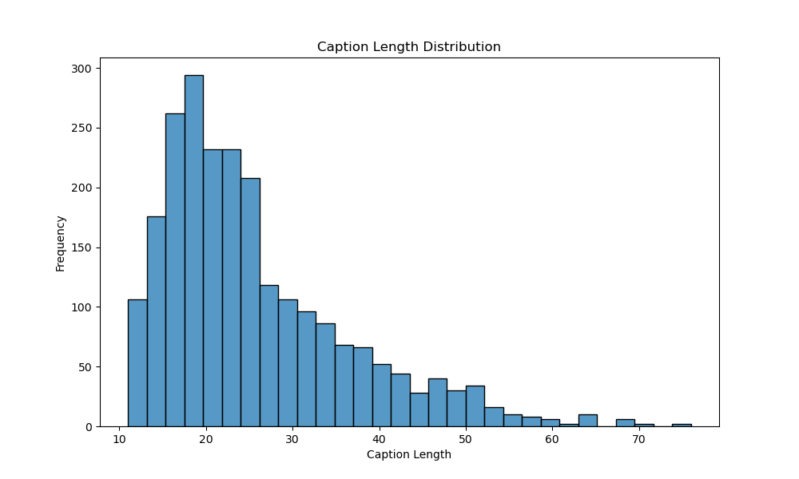
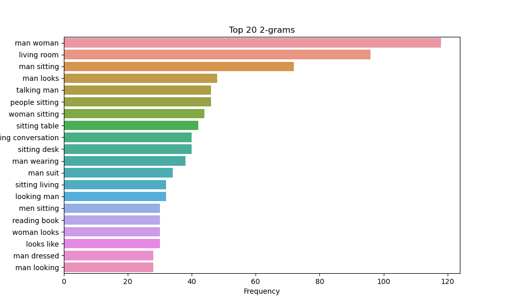
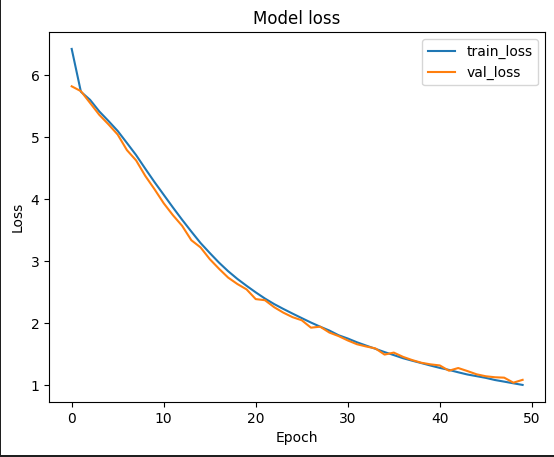

# 📚 Cartoon Captioning Project

Welcome to the Cartoon Captioning Project! This project aims to generate captions for cartoon images using deep learning or transformer based techniques. You can choose between two model architectures: **LSTM-CNN** and **ViT-GPT2**.

---

## 🌟 Features

- **Data Loading and Preprocessing**
- **Exploratory Data Analysis (EDA)**
- **Model Training and Evaluation**
- **Visualization of Results**

---

## 🏗️ Directory Structure

```plaintext
cartoon_captioning/
│
├── config/
│   └── config.yaml
├── data/
│   ├── dataset.py
│   └── load_data.py
├── eda/
│   ├── eda.py
│   └── plot.py
├── models/
│   ├── lstm_cnn.py
│   ├── vit_gpt2.py
│   ├── build_model.py
│   ├── train_model.py
│   └── evaluate_model.py
├── utils/
│   ├── image_processing.py
│   └── text_processing.py
├── train.py
└── requirements.txt
```
</br>

---
## ⚙️ Installation

```
  cd cartoon-image-generator
  python -m venv cap_env
  source cap_env/bin/activate
  pip install -r requirements.txt

```
---

## 🔧 Configuration
```
embedding_dim: 256
units: 256
vocab_size : 10000
image_feature_dim : 100352
batch_size: 32
epochs: 2
model_save_path: 'models/saved_model'
tokenizer_path: 'models/tokenizer.pkl'
max_length: 40
model_type: 'lstm_cnn'  # or 'vit_gpt2' for using 'ViT-GPT2' model

```
---

## 🚀 Running Script

```
python train.py --config config/config.yaml --model_type lstm_cnn

python train.py --config config/config.yaml --model_type vit_gpt2
```
---

## 🖼️ Example Outputs

### EDA 
<div align="center">
    
</div>
<div align="center">
    
</div>
<div align="center">
    
</div>
<div align="center">
    
</div>

---
### Models Training

<div align="center">
    
</div>

---

## 🌐 Running App

```
python app.py --config config/config.yaml
http://127.0.0.1:5000

```
